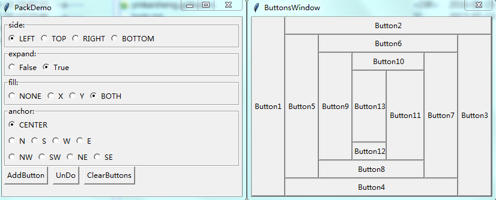
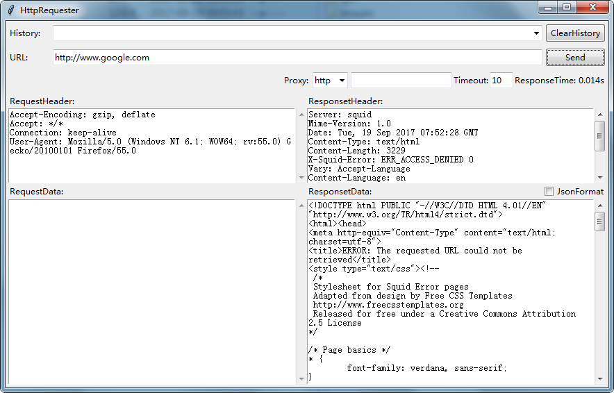
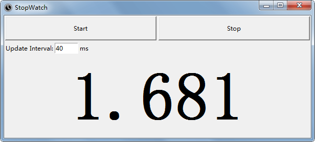
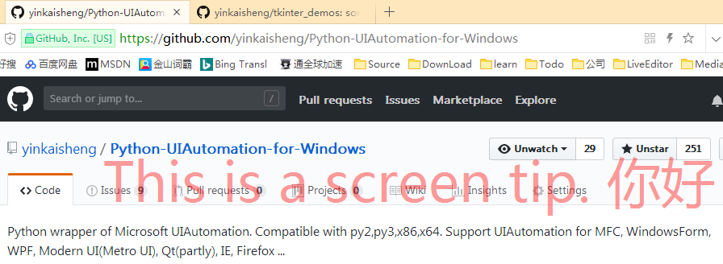
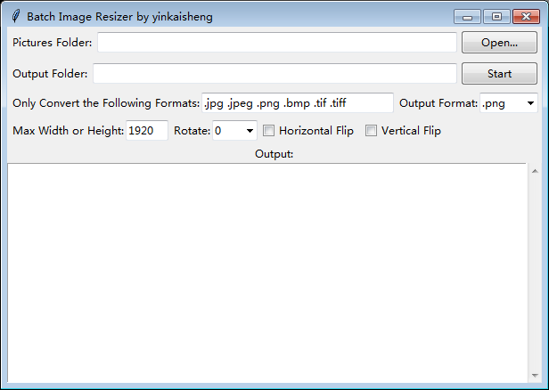
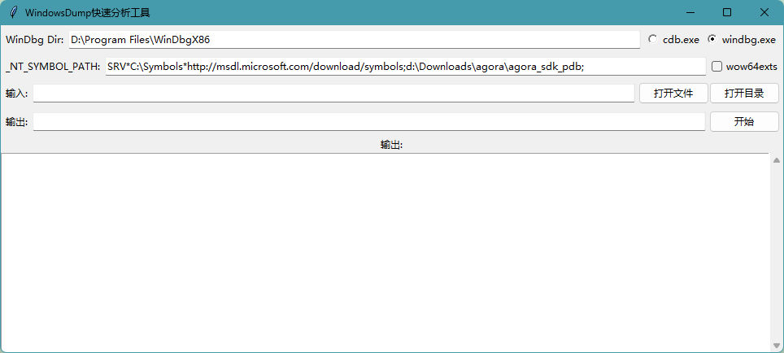

# tkinter_demos
some tkinter demos by yinkaisheng@live.com

**pack_demo**

pack_demo.pyw demonstrates how pack works.

You can add buttons with different pack configurations(side, expand, fill, anchor) or undo it on the fly.

**HttpRequester**

HttpRequester.pyw is a simple http client using requests.

**StopWatch**

**ScreenTip**

ScreenTip.pyw is a tool than shows a topmost tip over other windows while you still can click(operate) the windows under the tip.

**BatchImageResizer**

BatchImageResizer.pyw is a tool than can batch process image files.

**WinAnalyzeDump**

WinAnalyzeDump.py is a tool that uses windbg.exe or cdb.exe to anlayze crash dumps.

